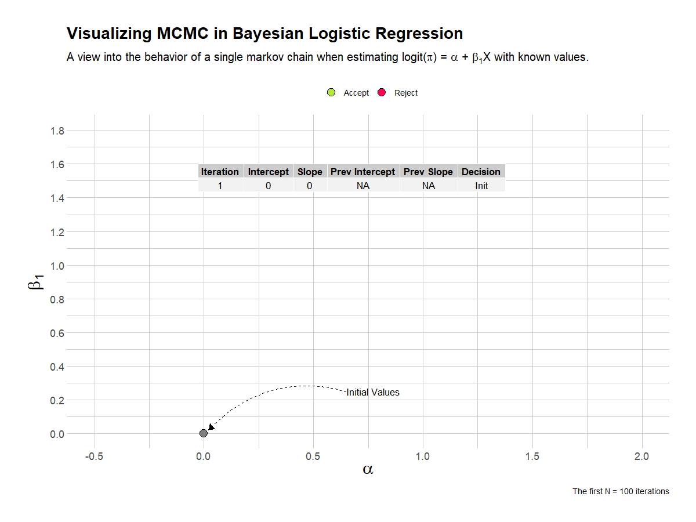

```{r setup, include=FALSE}
## Global options
knitr::opts_chunk$set(cache = TRUE)
```


## Overview

This article serves as an overview of a collection of interrelated statistical concepts I've been toying with how to present in my spare time. All code and output can be found on my github repository [here](https://github.com/mattkumar/mcmc).

Briefly, I cover the following concepts in a few (well commented) R scripts:

* How to generate data from a known statistical model
  + Specify a binary logistic regression model and generate data from it
  + Verify the results of the simulation
<br>
<br>
* Construct a Markov Chain Monte Carlo (MCMC) sampler
  + Implement the [Random Walk Metropolis Hastings algorithm](https://en.wikipedia.org/wiki/Metropolis%E2%80%93Hastings_algorithm) from scratch to perform a `Bayesian Logistic Regression`
<br>  
* Visualize results
  + Build an intuition for what the MCMC algorithm does through the use of animations via the `{gganimate}` package
 
Some prior knowledge of Bayesian statistics is useful.

## Visualization 1: Step-by-Step

This is an example visualization that shows the first 100 iterations of a single chain. I've overlaid the current parameter values, previous parameter values and the decision taken by the algorithm at each iteration. I have slowed down the animation so that it is easy to follow.

```{r, echo = F}

```

## Visualization 2: Full View

This is an example visualization that shows the chain running for the full 10,000 iterations. Contextual information is withheld and the animation speed is increased. You can see the chain eventually settles on what the known parameter values are.

```{r, echo = F}
knitr::include_graphics('full.gif')
```